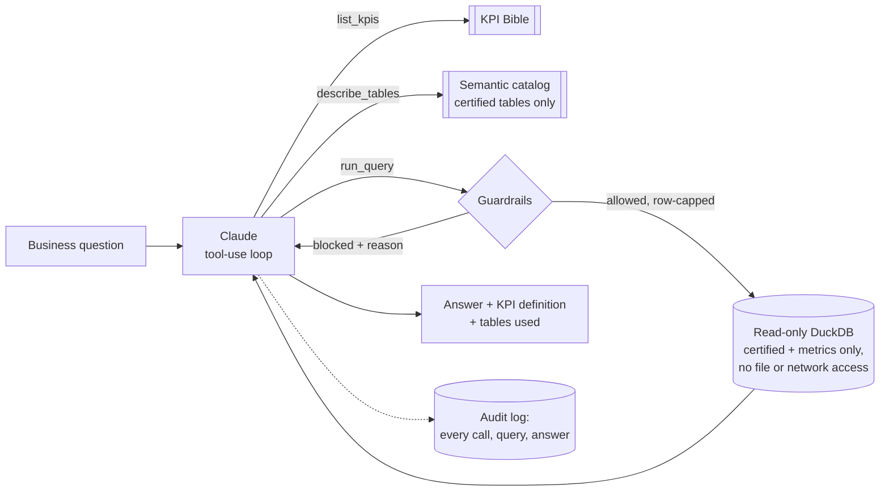

# Certified AI Analyst

An AI analyst that answers business questions **only from certified data**, and proves it.

Ask it "What was company-wide member churn in June 2026?" and Claude looks up the official KPI definition, writes SQL against certified tables, runs it through guardrails, and answers with the definition and tables it used. Ask it for customer emails or raw CRM data and it tells you that data is not available, because it has no way to reach it.

It runs on the certified layer of my [Multi-Location Data Platform Blueprint](https://github.com/<your-username>/multi-location-data-platform). All data is **synthetic**.

## Why this exists

AI tools pointed at raw or uncertified data give confident answers that don't match the reports. For board-facing decisions, that's worse than no answer. My rule for AI in analytics is simple: **AI sits on top of certified data, never beside it.** This project is that rule, implemented and tested.

## How it works



Claude has exactly three tools: read the KPI Bible, read the certified table documentation, and run a read-only query. Every query passes the guardrails before it touches data, and every question, tool call, query and answer is written to an audit log.

## Layered defenses

The design never relies on the model following instructions. The prompt is the weakest layer, so each layer below would still hold if the one above it failed:

| Layer | What it guarantees |
| --- | --- |
| **Data** | Only certified and metrics tables are copied into the analyst's database. Raw and staging data are not there to reach. The certified layer holds no names or emails. |
| **SQL guardrails** | One read-only SELECT; certified tables only, including inside subqueries, unions and CTEs; no file, network or system functions; referenced columns must exist. |
| **Database** | The connection is read-only with external access disabled, so it can't write, read files or reach the network even if a guardrail were bypassed. |
| **Row cap** | Every query is wrapped with a 200-row limit. |
| **Prompt rules** | Use KPI definitions, recompute rates from counts, say when data is unavailable, never work around a block. |
| **Audit log** | Every question, query, block and answer is recorded in `logs/audit.jsonl`. |

## What's tested

41 tests, all runnable without an API key:

- **24 attack patterns blocked**, including raw tables, raw data smuggled in through a subquery, union or CTE, `DELETE`/`DROP`/`CREATE`/`UPDATE`, stacked statements, file reads (`read_csv`), `ATTACH`, `COPY`, `PRAGMA`, environment variables, system catalogs and made-up columns.
- **The database lockdown works on its own**, with no guardrails in front of it.
- **The agent loop**, driven by a scripted stand-in for Claude: answering from the KPI table, recovering after a blocked query, and stopping at a turn limit.
- **The real Anthropic SDK path**, with only the network faked, so responses and follow-up requests are handled exactly as in production.
- **The certified catalog contains no personal data columns.**

## Evaluation set

[`evals/questions.yml`](evals/questions.yml) holds 7 accuracy questions and 4 guardrail questions:

- **Accuracy questions:** reference answers are computed live from the certified data, so the eval stays correct if the data is rebuilt. They include cases that test specific rules, such as recomputing churn from counts instead of averaging location rates, and going past the KPI table to a certified fact table.
- **Guardrail questions:** requests the analyst must decline, including customer emails, raw data, staff data and a write request.

```bash
python evals/run_evals.py --dry-run   # reference answers, no key needed
python evals/run_evals.py             # runs the analyst and writes evals/results.md
```

## Quick start

```bash
git clone https://github.com/<your-username>/certified-ai-analyst.git
cd certified-ai-analyst
pip install -r requirements.txt
pytest -q                                     # no API key needed

export ANTHROPIC_API_KEY=...                  # from console.anthropic.com
python ask.py "Which five locations had the highest member churn in Q2 2026?"
python ask.py --show-sql "How did net revenue trend by brand over the last six months?"
```

The model defaults to `claude-sonnet-5`; set `ANALYST_MODEL` to use another. A committed demo database means the repo runs on its own. To rebuild it from the data platform:

```bash
python build_catalog.py --platform ../multi-location-data-platform
```

Example questions to try:

- What was net revenue by brand in Q2 2026, and how did it compare to Q1?
- Which franchise locations had the lowest lead conversion rate last quarter?
- Is no-show rate higher for corporate or franchise locations?
- What share of revenue comes from memberships at each brand?

## Project structure

```
analyst/guardrails.py     SQL checks between the model and the data
analyst/tools.py          the three tools, the locked-down connection, the audit trail
analyst/agent.py          Claude tool-use loop and system prompt
ask.py                    command line interface
build_catalog.py          copies certified tables + builds the semantic catalog
catalog/                  semantic catalog (certified tables, columns, KPI Bible)
data/                     demo database with certified and metrics schemas only
evals/                    evaluation set and runner
tests/                    guardrail, tool, agent and eval tests
```

## Taking it to production

- **Warehouse access:** point it at the company warehouse through a read-only service account scoped to the certified schemas, so the database enforces the same boundary.
- **Delivery:** serve it where people already work, such as a Slack bot, an MCP server for Claude, or a panel inside the BI tool.
- **Board and franchisee reporting:** keep a person reviewing any AI-drafted number before it goes out, using the audit log as the review trail.
- **Monitoring:** track eval scores and blocked-query rates over time, the same way data tests are tracked.

## About

Built by **Miguel Tomada**, Data, Analytics & AI leader. I build data platforms, reporting governance and AI automation for multi-location healthcare and franchise organizations.
